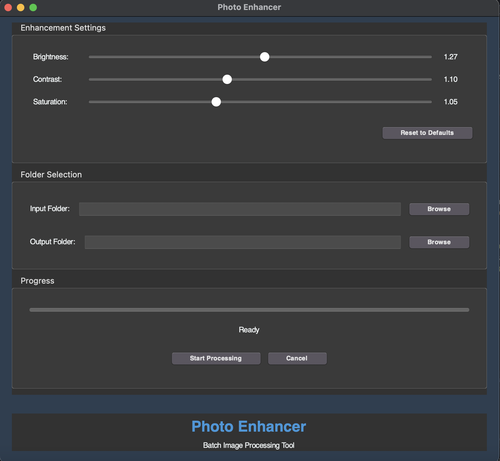

# Photo Enhancer

A simple, open-source photo processing application that automatically enhances images in bulk by adjusting brightness, contrast, and saturation.

## Features

- Batch process multiple images at once
- Adjustable enhancement settings:
  - Brightness (0.5 - 2.0)
  - Contrast (0.5 - 2.0)
  - Saturation (0.5 - 2.0)
- Settings are automatically saved
- Simple and intuitive interface
- Progress tracking
- Cancel processing at any time

## Screenshots

### Before and After Comparison

  <table>
    <tr>
      <td align="center"><strong>Before</strong></td>
      <td align="center"><strong>After</strong></td>
    </tr>
    <tr>
      <td></td>
      <td></td>
    </tr>
  </table>

### Main Application Window

  

