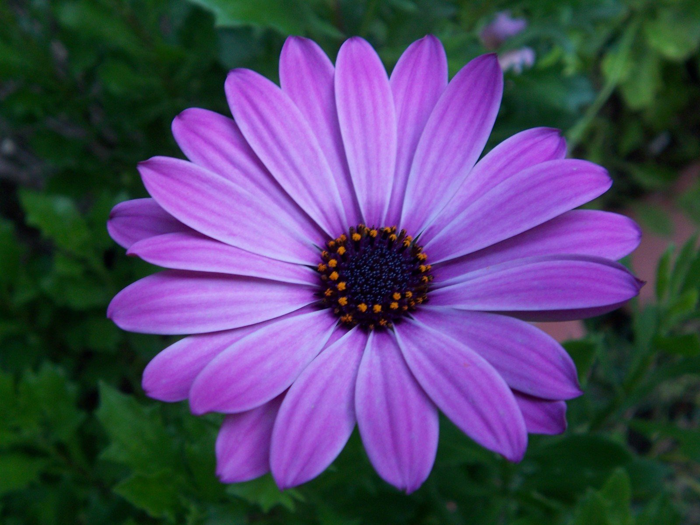
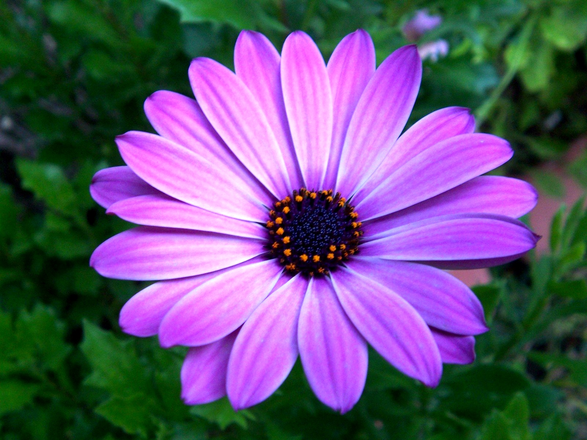

# Photo Enhancer

A simple, open-source photo processing application that automatically enhances images in bulk by adjusting brightness, contrast, and saturation.

    
    

        
    

    <input type="range" class="comparison-slider" style="position: absolute; top: 0; left: 0; width: 100%; height: 100%; -webkit-appearance: none; background: none; cursor: pointer; margin: 0;" min="0" max="100" value="50">

## Features

- Batch process multiple images at once
- Adjustable enhancement settings:
  - Brightness (0.5 - 2.0)
  - Contrast (0.5 - 2.0)
  - Saturation (0.5 - 2.0)
- Settings are automatically saved
- Simple and intuitive interface
- Progress tracking
- Cancel processing at any time

## Screenshots

    

